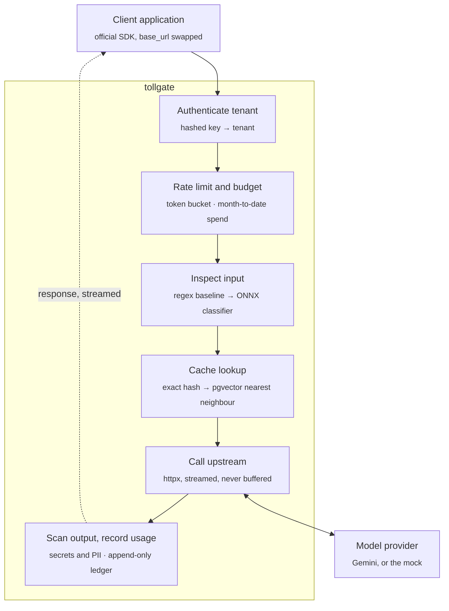

# Tollgate

A multi-tenant gateway for model API traffic. It sits between an application and a model provider
(Google Gemini), authenticates tenants, enforces rate limits and spend budgets, caches what it can,
inspects traffic in both directions, and records every token.

Request and response bodies stay byte-compatible with the provider's API, so an existing
application adopts Tollgate by changing one base URL, and the official SDK keeps working.

> **Status:** early development. The scaffold, mock upstream, local stack and first migration are
> in place. The proxy itself is next. See [Roadmap](#roadmap).

## Why a gateway exists

An application that calls a model API directly has no good answer to a handful of questions: which
customer spent what, what happens when one of them gets stuck in a retry loop, whether a user
smuggled instructions into a prompt, and whether a response leaked a credential. Once more than one
team, customer or feature calls the API, each call site ends up reimplementing the same rules:
keeping the provider key out of client code, deciding who may spend how much, retrying rate limits,
logging usage for billing, and checking what crosses the boundary. Spread across services, those
rules drift apart. A gateway puts them in one place on the request path. It's also the only
component that sees every token in both directions, which makes it the right place to measure cost,
latency and cache effectiveness.

## How a request flows



The return path is the hard part. Output scanning wants a complete response, and streaming never
provides one.

## Design decisions

Decisions made up front, before the code that depends on them:

| Decision | Why |
|---|---|
| Byte-compatible with the provider API | Adoption is a base URL change. It also means streaming has to be relayed event by event, not rebuilt. |
| Provider credential stays server side | Tenants authenticate to Tollgate with their own keys and never see the upstream key. |
| Tenant keys stored only as SHA-256 hashes | A database leak doesn't expose live credentials. A short plaintext prefix identifies a key in logs. |
| Money in integer minor units | Floating-point cost errors are small, silent and impossible to reconstruct later. A test will enforce it. |
| Budgets reserved before the upstream call | A streamed response's cost is unknown when it starts, so an estimate is reserved from the requested maximum and reconciled when the stream ends. |
| Caches scoped per tenant | A shared cache leaks information about one tenant's traffic to another. |
| Semantic cache threshold chosen from a measured curve | A wrong semantic hit is a correctness bug, not a performance trade-off. The false hit rate gets published next to the savings. |
| Detection defaults to monitor mode | Blocking is opt-in per tenant, which is how detection is rolled out in practice. |
| No prompt or response text in telemetry | Enforced by a test, not by convention. |
| Every benchmark runs against a local mock | Tests and load tests cost nothing and don't depend on provider variability. |

## Results

Every number below will be regenerated by a command in this repository. Cells stay empty until the
measurement exists, including the ones that turn out badly.

| Measurement | Compared against | Phase | Result |
|---|---|---|---|
| Gateway overhead, p50 and p99 | Same call made directly to the provider | 1, 8 | — |
| Added time to first token, streamed | Direct streaming call | 3 | — |
| Rate limit accuracy across containers | In-process counters vs Redis | 4 | — |
| Budget reservation error, streamed | Reserved estimate vs reconciled actual | 4 | — |
| Usage rollup query time | Before and after the index, with plans | 4 | — |
| Cache hit rate, exact and semantic | Each other, and no cache | 6 | — |
| Spend avoided per 1,000 requests | Identical traffic with caching disabled | 6 | — |
| Semantic false hit rate at chosen threshold | Full threshold sweep | 6 | — |
| Injection recall and precision | Regex baseline on identical data | 7 | — |
| False positives on benign security-related prompts | Ordinary benign prompts | 7 | — |
| Added latency per detection layer | Detection disabled | 7 | — |
| Throughput ceiling and failure mode | Steady vs burst vs degraded upstream | 8 | — |
| Deploy time, merge to live | Pipeline runs | 2 | — |
| Monthly infrastructure cost | Billing console | 2 | — |

## Roadmap

- [x] **0. Scaffold.** uv, ruff and mypy; mock upstream with scripted SSE and faults; Postgres and
  pgvector via Compose; Alembic with `tenants` and `api_keys`.
- [ ] **1. Passthrough proxy.** Tenant key auth with revocation, provider key held server side,
  one usage row per request, pooled httpx client with timeouts and jittered retries, distinct
  gateway and upstream error shapes.
- [ ] **2. Ship it.** Terraform for ECR, ECS Fargate, ALB, IAM and Secrets Manager; GitHub Actions
  with OIDC that tests, deploys, smoke tests and rolls back; readiness checks; a billing alarm.
- [ ] **3. Streaming.** Unbuffered SSE relay, usage parsed from the stream, correct accounting on
  client disconnect and mid-stream upstream failure, bounded memory.
- [ ] **4. Limits and budgets.** Per-tenant token buckets in Redis, versioned price table, budget
  reservation and reconciliation, append-only ledger, a spend endpoint per tenant.
- [ ] **5. Observability.** OpenTelemetry traces per request, Prometheus metrics that separate
  gateway overhead from upstream time, a version-controlled Grafana dashboard, one real alert.
- [ ] **6. Caching.** Exact cache on a normalised request hash, semantic cache on pgvector, cached
  responses replayed as a stream, threshold picked from a precision–recall sweep.
- [ ] **7. Detection.** Regex baseline, ONNX classifier for prompt injection, secret and PII
  scanning on output, per-tenant policy modes, an evaluation harness wired into CI.
- [ ] **8. Load test and write-up.** k6 scenarios for steady load, bursts, a degraded upstream,
  and warm vs cold cache.

### Out of scope

- **A web console.** Grafana is the interface; tenants are created with a small CLI.
- **Multiple providers.** One provider behind a thin interface, so adding a second stays possible.
- **Training a classifier.** A published model is integrated and measured.
- **Signup, onboarding or billing.**
- **Kubernetes.** Fargate and Terraform cover the deployment story.
- **A frontend.**

## Stack

| Layer | Choice | Status |
|---|---|---|
| Language | Python 3.13 | in use |
| Web | FastAPI, uvicorn | in use |
| HTTP client | httpx | in use |
| Database | Postgres 17 with pgvector (Neon in production) | in use locally |
| Migrations | Alembic, SQLAlchemy 2.0 async | in use |
| Tooling | uv, ruff, mypy (strict), pytest | in use |
| Local environment | Docker Compose | in use |
| Counters | Redis | phase 4 |
| Compute | AWS ECS Fargate | phase 2 |
| Infrastructure | Terraform | phase 2 |
| Pipeline | GitHub Actions with OIDC | CI in use, deploy in phase 2 |
| Tracing and metrics | OpenTelemetry, Prometheus, Grafana Cloud | phase 5 |
| Detection | ONNX Runtime with a published classifier | phase 7 |
| Load testing | k6 | phase 8 |

## Getting started

Requires [uv](https://docs.astral.sh/uv/) and Docker.

```sh
cp .env.example .env
docker compose up -d --wait     # Postgres + pgvector on :5432, mock upstream on :8001
uv sync
uv run alembic upgrade head
```

Run the checks CI runs:

```sh
uv run ruff check . && uv run ruff format --check .
uv run mypy
uv run pytest
```

The test suite needs no network access and no provider key.

## Mock upstream

[`mock_upstream/main.py`](mock_upstream/main.py) imitates the Gemini `v1beta` API so everything
can be developed, tested and load tested without spending money. It supports `generateContent`,
`streamGenerateContent` (SSE with `?alt=sse`, a JSON array otherwise), `countTokens` and
embeddings, with Google-shaped errors and `usageMetadata` on every response.

It can be told to misbehave in two ways.

**Per request**, with directives in the prompt text, which pass through the gateway untouched:

| Directive | Effect |
|---|---|
| `[[mock:error=429]]` | Return that HTTP status with a Google-style error body |
| `[[mock:slow=2000]]` | Add latency in milliseconds |
| `[[mock:hang]]` | Wait five minutes before responding (timeout testing) |
| `[[mock:midstream]]` | Drop the connection halfway through a stream |
| `[[mock:tokens=500]]` | Produce roughly that many output tokens |
| `[[mock:thinking=200]]` | Report thinking tokens, which are billed as output |
| `[[mock:leak]]` | Reply with fake PII, a fake credential and an injection string |

**As a script**, which the next generate call plays exactly:

```sh
curl -X POST localhost:8001/_mock/scripts -H 'content-type: application/json' \
  -d '{"steps": [{"text": "Hel"}, {"delayMs": 500, "text": "lo"}, {"disconnect": true}]}'
```

`GET /_mock/stats` shows how many calls reached the upstream and how many tokens were served, which
is how cache hits are verified. `GET /_mock/requests` shows the request bodies exactly as the
upstream received them, which is how input redaction is verified. The module docstring is the full
reference.

## Migrations

```sh
uv run alembic revision --autogenerate -m "describe the change"
uv run alembic upgrade head
uv run alembic check            # fails if models and migrations have drifted
```

Autogenerate compares the SQLAlchemy models with the live database. It doesn't detect extensions,
custom types, functions or triggers, and it reports a rename as a drop followed by an add. Read
every generated migration before applying it.

## Repository layout

```
src/tollgate/
├── main.py            ASGI app and routes
├── config.py          settings from the environment
├── auth.py            key hashing, tenant resolution
├── limits.py          token bucket, budget reservation
├── usage.py           append-only ledger, cost model
├── telemetry.py       OpenTelemetry and Prometheus wiring
├── proxy/             passthrough.py (unary), streaming.py (SSE relay)
├── cache/             exact.py (request hash), semantic.py (embeddings + pgvector)
├── detect/            baseline.py (regex), classifier.py (ONNX), scanner.py (secrets, PII)
└── db/models.py       SQLAlchemy models
migrations/            Alembic environment and versions
mock_upstream/         fake Gemini API: SSE, usage, scripted faults
tests/                 unit and integration tests, no network
bench/                 detection evaluation, cache threshold sweep, load scenarios
infra/                 Terraform (phase 2)
dashboards/            Grafana dashboard JSON (phase 5)
postgres/              init SQL for the local database
```
