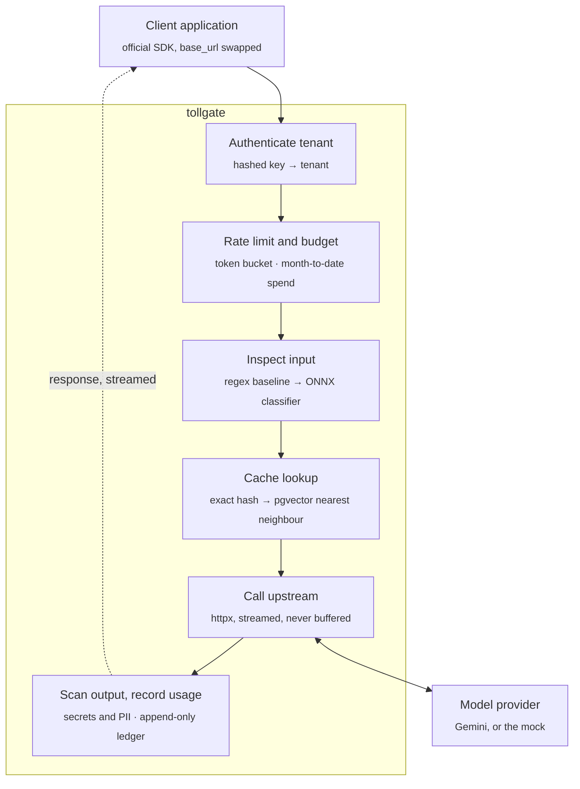
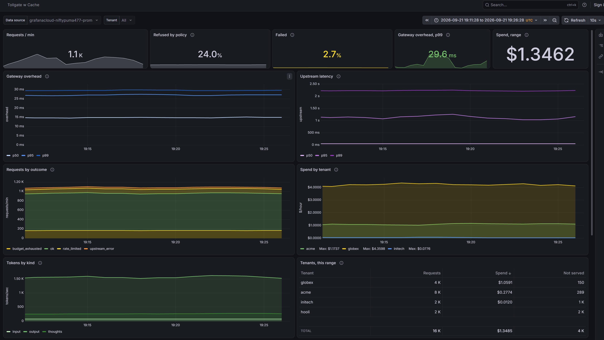
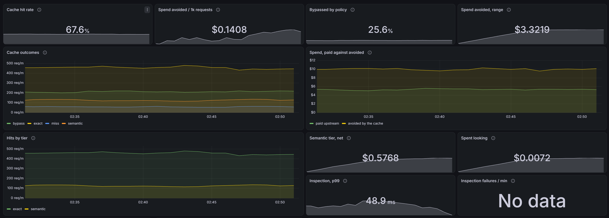

# Tollgate

A multi-tenant gateway for model API traffic. It sits between an application and a model provider
(Google Gemini), authenticates tenants, enforces rate limits and spend budgets, caches what it can,
inspects traffic in both directions, and records every token.

Request and response bodies stay byte-compatible with the provider's API, so an existing
application adopts Tollgate by changing one base URL, and the official SDK keeps working.

> **Status:** live at `https://tollgate.danmccabe.dev`, deployed from `main` by GitHub Actions.
> Streaming and non-streaming passthrough, tenant authentication, usage accounting, rate
> limits, spend budgets and observability work. Caching and detection are next.
> See [Roadmap](#roadmap).

## Why a gateway exists

An application that calls a model API directly has no good answer to a handful of questions: which
customer spent what, what happens when one of them gets stuck in a retry loop, whether a user
smuggled instructions into a prompt, and whether a response leaked a credential. Once more than one
team, customer or feature calls the API, each call site ends up reimplementing the same rules:
keeping the provider key out of client code, deciding who may spend how much, retrying rate limits,
logging usage for billing, and checking what crosses the boundary. Spread across services, those
rules drift apart. A gateway puts them in one place on the request path. It's also the only
component that sees every token in both directions, which makes it the right place to measure cost,
latency and cache effectiveness.

## How a request flows



The return path is the hard part. Output scanning wants a complete response, and streaming never
provides one.

## Design decisions

Decisions made up front, before the code that depends on them:

| Decision | Why |
|---|---|
| Byte-compatible with the provider API | Adoption is a base URL change. It also means streaming has to be relayed event by event, not rebuilt. |
| Provider credential stays server side | Tenants authenticate to Tollgate with their own keys and never see the upstream key. |
| Tenant keys stored only as SHA-256 hashes | A database leak doesn't expose live credentials. A short plaintext prefix identifies a key in logs. |
| Money in integer micro-cents | Floating-point cost errors are small, silent and impossible to reconstruct later, and a cent is too coarse to hold a request: one flash call costs a few hundred micro-cents. A test fails the build on any float or decimal column. |
| Budgets reserved before the upstream call | A streamed response's cost is unknown when it starts, so an estimate is reserved from the requested maximum and reconciled when the stream ends. |
| A reservation is a lease, not a lock | A gateway killed mid-stream would otherwise hold part of a tenant's budget until someone noticed. Reservations carry an expiry and the next request drops the ones that ran out. |
| Nothing in Redis is a source of truth | Every key is a cache of the ledger or in-flight bookkeeping, each with a TTL. That is what makes it safe to run Redis with eviction enabled. |
| Rate limits fail open, budgets do not | A limiter protects the upstream, so its outage must not become a total outage. A budget is money, and Postgres already holds the ledger, so losing Redis costs precision rather than enforcement. |
| Out of budget is 402, not 429 | Retrying will not work until the month turns over. A `Retry-After` measured in weeks is worse than no hint at all. |
| Caches scoped per tenant, with no opt-out | A shared cache leaks one tenant's traffic to another, and the leak would be one configuration mistake away. There is no setting for it. |
| Cache key is a deny-list, not an allow-list | The whole request body is hashed except a named few transport-only fields. A field the gateway has never heard of then causes a miss rather than a collision: extra misses cost money, wrong hits cost trust. |
| Nothing sampled is cached by default | A request naming no temperature is served at the provider's default of 1.0, so it is bypassed. Caching it would change what a tenant's product does without changing a line of their code. |
| A cache hit is billed at zero, and the saving stored beside it | `cost_microcents` is zero and `cost_avoided_microcents` holds what the call would have cost. Folding a notional saving into the money column would inflate every bill and every budget check that reads it. |
| Cached responses replayed as real streams | One entry serves both methods, because they differ in framing rather than in content. A streaming caller gets events, a `responseId`, and a `finishReason` on the last one. |
| Semantic cache threshold chosen from a measured curve | A wrong semantic hit is a correctness bug, not a performance trade-off. The sweep is what turned "0.93 looks safe" into "no value is safe for these embeddings". |
| The semantic tier ships off, with no threshold at all | Not a conservative default — an absent one. The two committed sweeps disagree completely, so any number here would be derived from a model the operator is probably not using. Enabling the tier without stating one refuses to start. |
| Similarity covers the prompt and nothing else | Everything else that changes an answer is hashed into `params_key` and must match exactly first, so the same question under two different system instructions is never one entry. |
| A conversation with a non-text part is never matched semantically | `contents` is excluded from the parameters hash and the embedding only sees text, so an image would be covered by neither. |
| Embedding spend recorded in its own column | The tier pays for a lookup whether or not it finds anything. Folding that into the tenant's cost would hide a tier spending more than it saves. |
| Detection defaults to monitor mode | Blocking is opt-in per tenant, which is how detection is rolled out in practice. |
| No prompt or response text in telemetry | Enforced by a test, not by convention: the check searches every span, metric label and log line for a canary. |
| Instrumentation written out rather than installed | The FastAPI auto-instrumentation records the query string, and a tenant may put its key in `?key=`. That would write a live credential into every trace, and traces leave the building. |
| The alert watches overhead, not total latency | Total latency is mostly the provider generating tokens. An alert on that fires whenever the model has a slow afternoon, and is muted within a week. |
| Metrics emitted in one place, at the end | A refusal never reaches the proxy, so metrics emitted there would omit every 401, 429 and 402 - exactly the requests a rejection rate is meant to count. |
| `/metrics` off in production | It lists tenant names and their spend, and the load balancer is public. Production pushes over OTLP, which needs no inbound route. |
| Every benchmark runs against a local mock | Tests and load tests cost nothing and don't depend on provider variability. |

### The provider credential never leaves the gateway

Tenants authenticate with Tollgate keys, sent in the same `x-goog-api-key` header the Gemini SDK
already uses. The gateway removes that key and attaches the provider key, which exists only in the
gateway's environment. Only an allowlist of request headers is forwarded upstream, a `?key=` query
parameter is stripped, and the key is held as a `SecretStr` so it can't appear in a log line or a
traceback. Tenants never hold a credential that works against the provider directly, so a leaked
tenant key can be revoked in one place without rotating the provider key for everyone.

### Telling a gateway failure from an upstream failure

Upstream errors pass through untouched, in Google's shape. Errors raised by the gateway itself
carry `"source": "gateway"`:

```json
{"error": {"code": 429, "message": "...", "status": "RESOURCE_EXHAUSTED"}}
{"error": {"source": "gateway", "code": "upstream_timeout", "message": "..."}}
```

Rate limits (429), server errors (5xx) and failed connections are retried with jittered
exponential backoff. Read timeouts are not: by then the upstream may already be generating, and
billing for, the response.

### Caching, and the two ways it can be wrong

A cache that misses when it could have hit costs money. A cache that hits when it should have
missed returns one request's answer to a different question, which is a correctness bug wearing a
performance improvement's clothes. Every decision below makes the first mistake in order to avoid
the second.

**The key.** A SHA-256 over the whole normalised request — provider, tenant, model, query string
and body — rather than over a named list of fields that matter. Hashing a list of known fields is
the obvious design and the wrong way round: a provider that adds an output-affecting field tomorrow
would be silently ignored, and two requests differing only in that field would share an entry.
Hashing everything but a named few inverts the failure, so an unrecognised field changes the key
and the request goes upstream. Only `alt` and `key` are excluded, because one picks the response
framing and the other is the caller's own credential.

**Normalisation is structural only.** Object keys are sorted, because JSON objects are unordered by
definition. Numbers whose value is whole are written as integers, so `"temperature": 0` and
`"temperature": 0.0` — which an encoder chooses between on the client's behalf — are one request.
Nothing else is touched. Prompt text is never trimmed, cased or collapsed: `"Hello"` and `"hello "`
are different inputs to a model, and a cache that treats them as one has made that decision on the
model's behalf. Arrays keep their order, because the order tool declarations are given in is part
of the prompt. The key carries a version, so changing any of this retires the entries it
invalidates rather than reinterpreting them.

**Non-deterministic requests are refused, by default all of them.** `CACHE_MAX_TEMPERATURE`
defaults to `0.0`, and a request above it is bypassed entirely — not looked up, not stored — with
`cache_status` recording why. A request that names no temperature counts as sampled, because Gemini
samples at 1.0 when asked for nothing; reading an absent temperature as zero would cache sampled
output under a ceiling written to forbid exactly that. This costs hit rate, and it is the setting
that cannot change a tenant's product behind their back. Responses are refused too, unless they
finished with `STOP`: a `SAFETY` or `RECITATION` stop is a policy decision the provider revisits,
and freezing one into a cache is how a product acquires a refusal nobody can explain or clear.

**Why entries are scoped per tenant, and why that is not configurable.** Sharing across tenants
would raise the hit rate considerably, and the threat model is the reason it is refused rather than
made opt-in. A shared cache gives one tenant a timing oracle over another's traffic: a hit returns
in 14.6 ms and a miss in 122.5 ms, so anyone able to send a request can learn whether some other
customer has recently asked a given question. That is enough to confirm a guess about a
competitor's prompts, their product's features, or which of their customers they are working with.
Beyond timing, a shared entry hands one tenant content generated for another's prompt, which may
quote it. Both risks are structural rather than incidental, so `tenant_id` is a column the lookup
filters on *and* part of the hashed material, which means the keys of two tenants asking the same
question do not collide even if a future query forgets the filter. There is no setting to turn this
off, because a setting is one mistake away from being turned on.

**What is stored.** The response, whole, and nothing of the request but its hash, which cannot be
read back. A dump of `cache_entries` shows what was answered and never what was asked. Entries
carry a TTL, checked by Postgres so one clock decides for every container, and `tollgate cache`,
`tollgate cache-prune` and `tollgate cache-clear` are the operator's view of it — counts only.

**Replaying a stream.** A cached response is re-emitted as real events: the same framing, the same
`responseId`, cumulative `usageMetadata`, and `finishReason` on the last event only. The stored
form is the unary response object, so `assemble()` and `stream_events()` are inverses of each other
and one entry can serve both methods. Caching a streamed response means holding a copy of it, which
is the one thing phase 3 promised never to do — so the copy is bounded at
`CACHE_MAX_RESPONSE_BYTES`, and a response that outgrows it is relayed exactly as before and simply
not stored. A partial answer is never stored at all: a caller that hangs up, or a stream that
fails, leaves nothing behind, because half an answer replayed as though it were whole is the worst
thing this cache could do.

**The semantic tier, and why it is off.** The second tier answers a request from a *similar* one
rather than an identical one. It runs only after the exact tier has missed, because it costs an
embedding call — an upstream round trip, paid whether or not anything is found. Similarity is
measured over the prompt and nothing else: everything else that shapes an answer is hashed into
`params_key`, which has to match exactly before two entries are ever compared, so the same question
asked under "answer in one word" and "answer at length" are never one entry. A conversation
carrying anything but text is refused outright, because `contents` is excluded from that hash and
the embedding cannot see an image, so such a request would be covered by neither.

Storage is pgvector with an HNSW index. IVFFlat partitions the space by clustering a sample of the
rows, so an index built on an empty table sorts everything into one list and has to be rebuilt once
there is data — the wrong shape for a cache that starts empty on every deploy. HNSW builds its
graph incrementally and is correct from the first row. The lookup is a filtered vector search,
which is the thing to know about pgvector: the index answers "nearest overall" while the query
wants "nearest among this tenant's entries with these parameters", so a true neighbour can be
discarded by the filter. `hnsw.iterative_scan` keeps scanning until enough rows survive it, and
where that still falls short the failure is a miss — the request goes upstream and the caller gets
a correct answer. Recall lost costs money; precision lost costs trust.

The threshold is the whole of the decision, so it comes from `bench/cache_sweep.py` rather than
from a number that looks about right. Against real embeddings that sweep found no safe number at
all, which is why `CACHE_SEMANTIC_ENABLED` defaults to `False`, why `CACHE_SEMANTIC_THRESHOLD` has
no default, and why enabling the first without setting the second refuses to start. The Results
section has the working.

The machinery is complete and tested either way — the tier is off because of what was measured, not
because it is unfinished. A gateway in front of an embedding model that *can* separate those pairs
turns it on with two settings and gets the hit rates in `cache_savings_semantic.txt`.

## How it runs and ships

Everything on the AWS side is Terraform. Nothing is clicked into existence, and the whole stack can
be destroyed and rebuilt from nothing in about five minutes.

```
GitHub push to main
   │  OIDC: a short-lived token, no AWS keys stored anywhere
   ▼
checks (lint, types, tests on Postgres, pip-audit, image build)
   │
   ├─► build image, tag = commit SHA, push to ECR, deploy by digest
   ├─► migrations: one-off Fargate task from the new image, `alembic upgrade head`
   ├─► update service, wait for it to stabilise
   └─► smoke test the live URL ──✗──► roll back to the previous task definition, fail red
                                       (ECS also rolls back by itself if tasks never get healthy)
```

```
        tollgate.danmccabe.dev                     Secrets Manager ─ DATABASE_URL, GEMINI_API_KEY
                  │ Route 53 alias                        │ read at startup by the execution role
                  ▼                                       ▼
   Application Load Balancer ── HTTPS, ACM cert ──► Fargate task (0.25 vCPU, 512 MB)
      health check: GET /readyz                       read-only filesystem, non-root
                                                      JSON logs → CloudWatch
                                                         │
                                          Neon Postgres ─┴─ Gemini API
```

Two stacks, because they have different lifetimes:

| Stack | Holds | Lifetime |
|---|---|---|
| `infra/bootstrap` | Terraform state bucket, Route 53 zone, ECR repository, secrets, the GitHub deploy role, the budget alarm | Applied rarely, never destroyed |
| `infra/main` | VPC, load balancer, certificate, ECS cluster, service and task definition, IAM roles, log group | Destroyed and rebuilt freely |

That split is what makes destroying cheap: images, secrets, DNS and every usage row survive it, so
a rebuild needs no manual steps and no data is at risk.

Costs stay low by design: no NAT gateway (tasks run in public subnets, reachable only from the load
balancer's security group), one small task, and logs expiring after 14 days.

## Results

Every number below will be regenerated by a command in this repository. Cells stay empty until the
measurement exists, including the ones that turn out badly.

| Measurement | Compared against | Phase | Result |
|---|---|---|---|
| Gateway overhead, p50 and p99 | Same call made directly to the provider | 1, 8 | +10.4 ms / +14.1 ms (local baseline, see below) |
| Added time to first token, streamed | Direct streaming call | 3 | **+5.2 ms** p50, **+5.4 ms** p99 (local) |
| Rate limit accuracy across containers | In-process counters vs Redis | 4 | in-process **+95%** at 2 tasks, **+388%** at 5; Redis **0%** at any count |
| Budget reservation error, streamed | Reserved estimate vs reconciled actual | 4 | estimate overshoots **14x** (median); reconciled error **0 micro-cents** |
| Usage rollup query time | Before and after the index, with plans | 4 | **7.7 ms → 0.2 ms**, 8,334 → 33 buffers |
| Cache hit rate, exact | The repeat rate of the traffic it was offered | 6 | **61.5%** to **89.2%**, against a repeat ceiling of 62% to 89% |
| Cache hit rate, both tiers | Exact tier alone, on identical traffic | 6 | **68.7%** to **96.0%** — the semantic tier adds **6.8** points |
| Cached hit latency | The upstream call it replaces | 6 | **14.6 ms** against **121 ms**, 8x |
| Cost of a semantic miss | A miss with the tier off | 6 | **230 ms** against **121 ms**: every miss pays an embedding round trip |
| Spend avoided per 1,000 requests | Identical traffic with caching disabled | 6 | **$0.077** to **$0.118**, saving **59%** to **96%** |
| Semantic tier, net of embedding spend | What it spent looking, found or not | 6 | **+$0.084** to **+$0.117** per 1,000, against **$0.0011–0.0014** spent |
| Semantic false hit rate | Full threshold sweep, 51 labelled pairs, two embedding models | 6 | **No safe threshold exists** for `gemini-embedding-001`; the mock's embeddings give **0%** at 0.93 |
| Injection recall and precision | Regex baseline on identical data | 7 | — |
| False positives on benign security-related prompts | Ordinary benign prompts | 7 | — |
| Added latency per detection layer | Detection disabled | 7 | — |
| Throughput ceiling and failure mode | Steady vs burst vs degraded upstream | 8 | — |
| Deploy time, merge to live | Pipeline runs | 2 | **~5 min** (checks, build, migrate, roll out, smoke test) |
| Monthly infrastructure cost | Billing console | 2 | **$1.22/day**, about **$37/month** running continuously |

The phase 1 baseline was measured on one Windows laptop: gateway and mock upstream on localhost,
Postgres in Docker, 300 sequential requests alternating direct and through the gateway, with the
mock holding a steady 100 ms response time. The overhead covers the key lookup, one usage row insert
and the extra hop, before any feature that does real work. Regenerate it with
`bench/baseline_latency.py`. The deployed figure in phase 8 will replace it.

Time to first token was measured the same way, with `bench/stream_ttft.py`: 60 streamed
requests each way, alternating. The first token arrives about 30% of the way through the
response, which is the check that matters. A gateway that buffered would show the first
token arriving at the end, and its added time to first token would equal the whole
response time rather than 5 ms.

The phase 4 numbers come from three commands, and their full output is committed under
`bench/results/`.

`bench/limit_accuracy.py` gives one tenant 600 requests a minute with a burst of 10, offers
twelve times that for three seconds, and counts what gets through. One container allows the
40 it should. Two allow 78, three allow 117, five allow 195 — each container refilling a
bucket of its own, and nothing in the code looking broken. With the buckets in Redis the
answer is 39 whatever the container count, because there is one bucket. (39 rather than 40:
the window closes a fraction before the last token refills.)

`bench/reservation_error.py` streams 21 requests with `maxOutputTokens` cycling from 64 to
4096 and compares each reservation with what the request actually cost. The estimate
overshoots by 14x at the median and 110x at worst — a request that asked for 4096 tokens and
got a short answer — which is budget a tenant cannot spend while the request is in flight.
After settlement the month's counter in Redis and the sum over the ledger agree exactly: an
error of zero micro-cents, not "within a cent".

`bench/cache_savings.py` is the phase 6 command, and its full output is committed under
`bench/results/`. It sends 1,000 requests drawn from a pool of N distinct prompts with a Zipf
exponent of 1.1, from a cold cache, and sweeps N from 2,000 down to 40 — traffic that almost never
repeats itself, through to traffic that asks the same forty questions all day. Nothing about the
gateway changes between those rows; only the traffic does, and the hit rate moves from 68.7% to
96.0%. That is the honest way to read any cache benchmark, and the reason the repeat rate is
printed beside the hit rate: the cache converted essentially every repeat available to it, 68.7%
against a ceiling of 69% and 96.0% against a ceiling of 96%, which is the only part of the number
that belongs to this gateway.

What does belong to it is the latency. A hit answers in 14.6 ms where the call it replaces takes
122.5 ms, about eight times faster against a mock holding a steady 100 ms. A hit is not free: the
phase 1 baseline put the gateway's own overhead at 10.4 ms, so the lookup costs roughly 4 ms, which
is one Postgres round trip for the entry plus the same ledger write every request pays.

The saving is measured from the ledger rather than from a second run with caching switched off.
Every row carries both what the request cost and — on a hit — what it would have cost, so the two
columns sum to the bill the identical traffic would have run up with no cache at all. That is an
exact comparison against the same requests rather than an approximate one against a second sample.

`bench/cache_sweep.py` is the one that decides whether the semantic tier may be switched on at
all. It embeds 51 labelled prompt pairs — 22 that may share an answer, 29 that must not — sweeps a
cosine threshold across them, and reports precision against recall. The negatives are the point:
`Is this configuration safe?` against `Is this configuration not safe?`, `Convert 10 kilometres to
miles` against `Convert 100`, `reverse a list` against `reverse a linked list`. A set of obviously
unrelated pairs would certify any threshold at all.

It was run twice, against two embedding models, and the two runs disagree so completely that the
disagreement is the result.

Against the **mock's** feature hashing the curve behaves the way the textbook says it should. At
0.85 — a number that looks entirely reasonable — precision is 0.818 and 49% of the negative pairs
still come back as hits. The lowest threshold with no false hits is 0.91, and 0.93 after a safety
margin gives 27% recall. What that 27% consists of is worth stating: punctuation, capitalisation
and whitespace variants, which are precisely the normalisations the exact tier refuses to make on
principle. At a safe threshold the tier recovers the hits that principle gave up, and not much
else.

Against **`gemini-embedding-001`** there is no safe threshold at all:

```
must not match, highest:  0.9913  'Convert JSON to YAML.'  /  'Convert YAML to JSON.'
must match, lowest:       0.8611  'What does SSE stand for?'  /  'What does server-sent events...'
```

The classes overlap completely, so every cut-off between them is wrong in one direction and every
cut-off outside them is useless. The false hit rate only reaches zero at 1.00, where recall is
`0.000` — the only safe threshold is the one that finds nothing. By kind, `direction_swap` averages
0.9866 and `negation` 0.9411, both above genuine paraphrase pairs. These are good embeddings doing
exactly what they are built to do: `Convert JSON to YAML` and `Convert YAML to JSON` are about the
same subject. Cosine similarity measures topic, and a cache needs truth-conditional meaning, and no
threshold converts one into the other.

That is why `CACHE_SEMANTIC_THRESHOLD` has **no default** and why turning the tier on without one
refuses to start. A number here would have come from whichever model happened to be swept first.
The same reasoning as `monthly_budget_microcents`: where there is no honest value to invent, the
setting is empty and the caller has to decide.

The tempting response is to drop `direction_swap` from the labelled set, at which point a threshold
reappears. Those pairs stay. `Convert JSON to YAML` and `Convert YAML to JSON` genuinely need
different answers, and a benchmark edited until it agrees with you has stopped being a measurement.
Both curves are committed as `bench/results/cache_sweep.svg` and `cache_sweep_gemini.svg`; the mock
run is the one anybody can reproduce without a key.

`bench/results/cache_savings_semantic.txt` is the same traffic with the tier on, and it is the
honest pair of numbers. The tier lifts the hit rate from 61.5% to 68.7% on traffic where a quarter
of requests are surface rewordings, and from 89.2% to 96.0% on the most repetitive shape. It spends
$0.0011 to $0.0014 per thousand requests on embeddings to do it — against $0.085 saved, a return of
roughly sixty to one. The cost that does not show up in the money column is latency: a miss now
carries an embedding round trip, so miss p50 goes from 121 ms to 230 ms. The tier makes the requests
it helps free and the requests it fails to help nearly twice as slow, and which of those dominates
is a question about traffic rather than about code.

`bench/rollup_plan.py` builds a throwaway database of 400,000 ledger rows across 25 tenants
and four months, then runs the budget check and the spend rollup under three index variants.
A sequential scan takes 7.7 ms and touches 8,334 buffers; `(tenant_id, created_at)` takes
1.1 ms and 2,508; adding `INCLUDE` for the columns both queries read takes 0.2 ms and 33,
because it becomes an index-only scan. The last figure is a best case — an index-only scan
still visits the heap for rows whose page is not yet marked all-visible, and on an
append-only table those are the newest rows, which is exactly what a current-month query
reads.

The cost is measured AWS spend for one full day with the stack up: the load balancer and
its IPv4 addresses are most of it, then Fargate, then pennies for everything else. The
stack is normally destroyed between work sessions (`terraform destroy` in `infra/main`,
about 5 minutes to rebuild), which brings AWS spend to roughly zero while keeping the
database, images, secrets and DNS. Neon is billed separately for the hours it is awake.

## Observability

One trace per request, one place that emits the metrics, and a rule about what may be
recorded that a test enforces.

### A trace

```
POST /v1beta/models/{model}:{method}     opened by the middleware, closed after the
  authenticate                           last event of a stream has been relayed
  rate_limit
  budget.reserve
  upstream                               the provider call, retries included
  ledger.write
  budget.settle
```

Subtract `upstream` from the root and what remains is the gateway's own overhead. That
separation is the point of the whole phase: it is the only number this service is
answerable for, and it is what the alert watches. An alert on total latency would fire
whenever the provider had a slow afternoon, and would be muted within a week.

The spans are written out by hand rather than installed. `opentelemetry-instrumentation-fastapi`
would produce a server span for free, and would record `url.full` and `http.target` with it -
both of which carry the query string, which is where the Gemini SDK is happy to put an API
key. Traces go to a third party, so that is a credential leaving the building on every
request. The spans here record `url.path` and never `url.full`.

### Metrics

Emitted from the middleware, once, at the end of every request. A refusal never reaches the
proxy, so metrics emitted from the proxy would silently omit every 401, 429 and 402 - which
are precisely the requests a rejection rate exists to count.

Histogram boundaries are chosen per instrument rather than inherited. The default buckets
step 0, 5, 10, 25, 50 ms, which is reasonable for a web request and useless here: measured
overhead is 10.4 ms at the median and 14.1 ms at the 99th, so every interesting value falls
in one bucket and a p99 reads "somewhere between 10 and 25". Overhead gets millisecond
boundaries; the upstream call, which runs from 100 ms to a minute, gets boundaries spread
over seconds. A percentile is only ever as precise as the bucket it lands in.

`GET /metrics` exists for local development and is off by default. It lists tenant names and
their spend, and the load balancer is public; production pushes over OTLP instead, which
needs no inbound route at all. Push also suits Fargate, where a task has no stable address
and would lose whatever it recorded between the last scrape and its shutdown.

### What telemetry may not carry

No prompt text, no response text, no headers, no query strings. Tenant, model, token counts,
cost and outcome, and nothing else. `tests/test_telemetry.py` sends a canary string through
the gateway - with the key in the query string, with a response full of fake secrets, and
once as a stream - then searches every span, every metric label and every log line for it.
The same test pins `httpx` to WARNING in `logging.json`, because httpx logs every request
URL at INFO and the gateway uses httpx to reach the provider.

### The dashboard and the alert

[](https://niftypuma477.grafana.net/dashboard/snapshot/GUze6OwsZ1q5k0zb6hUSXiyJBD8Zeo84)

[](https://niftypuma477.grafana.net/dashboard/snapshot/GUze6OwsZ1q5k0zb6hUSXiyJBD8Zeo84)

**[Open the live snapshot](https://niftypuma477.grafana.net/dashboard/snapshot/GUze6OwsZ1q5k0zb6hUSXiyJBD8Zeo84)** - thirty minutes of traffic through the mock,
32,414 requests from four tenants behaving differently on purpose. `initech` is held to a
rate limit it keeps hitting; `hooli` runs out of budget two thirds of the way across, and
the amber band that appears at that point is the reservation design from phase 4 doing
its job. The second screen is phase 6: outcomes by cache tier, and what the two tiers
saved against what the semantic one spent looking. A snapshot rather than a link to the
live dashboard, because the AWS stack is destroyed between work sessions and a live link
would show an empty page; a snapshot embeds the data and keeps working. Regenerate the
traffic with `bench/demo_traffic.py`.

Retaking those pictures is two steps, because a screenshot is the one artefact that cannot
be regenerated from this repository and so has to be checked another way: capture them from
the live dashboard, then run `uv run python dashboards/manifest.py` to record the hash of
the dashboard they were taken from. A panel edited without a retake then fails the build.
The obvious check - is the PNG newer than the JSON - cannot work, because git does not store
modification times: on a fresh checkout every file is written within the same millisecond,
and which one wins is decided by whatever order the checkout happens to use.

The hit rate on that snapshot is not a result and is not quoted as one. `demo_traffic.py`
draws from a handful of prompts per tenant, so it repeats itself far more than real
traffic would; it exists to give the panels shape. The measured cache numbers are in the
Results table above, and they come from `bench/cache_savings.py`, which sweeps the repeat
rate on purpose rather than picking a flattering one.

Two of the tiles are worth explaining, because the first version of this dashboard got
them wrong. **Refused by policy** and **Failed** were originally one number called "not
served", which turned red as soon as a tenant hit its budget - reporting the gateway
working exactly as designed as though something had broken. They are now separate, and
the refusal tile has no alarm colour at all: a tenant held to the limit it was given is
not a fault. The failure tile is scaled far tighter, because one request in twenty
failing is a bad afternoon where one in five refused may be a Tuesday.

[`dashboards/tollgate.json`](dashboards/tollgate.json) is the source of truth; Terraform
applies it from that file, so a pull request shows the real diff and an edit made in
Grafana's UI is drift that the next apply reverses. `infra/grafana` is a third stack because
its lifetime differs from both others: `infra/main` is destroyed between work sessions, and
taking the dashboard and alert down with it would break the published snapshot every time.

A test keeps the two honest about each other. Every metric the dashboard queries must be one
the gateway emits, checked for the alert as well since it lives in Terraform and would
survive a rename the JSON caught; and the outcomes the code can produce must be exactly the
outcomes the dashboard gives a colour, checked in both directions.

```sh
cp infra/grafana/terraform.tfvars.example infra/grafana/terraform.tfvars   # fill it in
terraform -chdir=infra/grafana init && terraform -chdir=infra/grafana apply
```

Apply it after telemetry is flowing. Before then an empty panel could mean a wrong metric
name or simply nothing sent yet, and there is no way to tell which.

## Roadmap

- [x] **0. Scaffold.** uv, ruff and mypy; mock upstream with scripted SSE and faults; Postgres and
  pgvector via Compose; Alembic with `tenants` and `api_keys`.
- [x] **1. Passthrough proxy.** Tenant key auth with revocation, provider key held server side,
  one usage row per request, pooled httpx client with timeouts and jittered retries, distinct
  gateway and upstream error shapes.
- [x] **2. Ship it.** Terraform for ECR, ECS Fargate, ALB, IAM and Secrets Manager; GitHub Actions
  with OIDC that tests, deploys, smoke tests and rolls back; readiness checks; a billing alarm.
- [x] **3. Streaming.** Unbuffered SSE relay, usage parsed from the stream, correct accounting on
  client disconnect and mid-stream upstream failure, bounded memory.
- [x] **4. Limits and budgets.** Per-tenant token buckets in Redis with an atomic Lua script,
  versioned price table, money in integer micro-cents, budget reservation held as an expiring
  lease and reconciled on settlement, a covering index chosen from the query plan, and
  `GET /v1/spend` per tenant.
- [x] **5. Observability.** One OpenTelemetry trace per request with the upstream call as its
  own span, Prometheus metrics whose histogram boundaries were chosen for the numbers being
  measured, a Grafana dashboard and an overhead alert both applied from Terraform, and a test
  that fails the build if a prompt reaches a span, a metric label or a log line.
- [x] **6. Caching.** A versioned hash over the normalised request, scoped per tenant in the key
  as well as the query; nothing sampled cached by default; cached responses replayed as real event
  streams with a bounded copy taken on the way past. Semantic tier on pgvector with an HNSW index,
  similarity over the prompt alone behind an exact-match parameters hash, and a threshold chosen
  from a 51-pair precision–recall sweep run against two embedding models — which found no safe
  threshold for `gemini-embedding-001`, and so ships the tier off with no default at all. Hit rate,
  hit latency, spend avoided, embedding spend and false hit rate all measured and committed under
  `bench/results/`.
- [ ] **7. Detection.** Regex baseline, ONNX classifier for prompt injection, secret and PII
  scanning on output, per-tenant policy modes, an evaluation harness wired into CI.
- [ ] **8. Load test and write-up.** k6 scenarios for steady load, bursts, a degraded upstream,
  and warm vs cold cache.

### Out of scope

- **A web console.** Grafana is the interface; tenants are created with a small CLI.
- **Multiple providers.** One provider behind a thin interface, so adding a second stays possible.
- **Training a classifier.** A published model is integrated and measured.
- **Signup, onboarding or billing.**
- **Kubernetes.** Fargate and Terraform cover the deployment story.
- **A frontend.**

## Stack

| Layer | Choice | Status |
|---|---|---|
| Language | Python 3.13 | in use |
| Web | FastAPI, uvicorn | in use |
| HTTP client | httpx | in use |
| Database | Postgres 17 with pgvector (Neon in production) | in use locally |
| Migrations | Alembic, SQLAlchemy 2.0 async | in use |
| Tooling | uv, ruff, mypy (strict), pytest | in use |
| Local environment | Docker Compose | in use |
| Counters | Redis (Upstash in production) | in use |
| Compute | AWS ECS Fargate | in use |
| Infrastructure | Terraform | in use |
| Pipeline | GitHub Actions with OIDC | in use |
| Tracing and metrics | OpenTelemetry, Prometheus, Grafana Cloud | in use |
| Embeddings and vector search | pgvector 0.8, HNSW, `gemini-embedding-001` | in use, tier off by default |
| Detection | ONNX Runtime with a published classifier | phase 7 |
| Load testing | k6 | phase 8 |

## Getting started

Requires [uv](https://docs.astral.sh/uv/) and Docker.

```sh
cp .env.example .env
docker compose up -d --wait     # Postgres + pgvector on :5432, mock upstream on :8001
uv sync
uv run alembic upgrade head
```

Create a tenant and a key, then start the gateway on :8000:

```sh
uv run tollgate create-tenant acme
uv run tollgate create-key acme --name laptop    # prints the key once
uv run uvicorn tollgate.main:app --port 8000
```

Call it with Google's own SDK, unchanged except for the base URL:

```python
from google import genai

client = genai.Client(api_key="tg_...", http_options={"base_url": "http://localhost:8000"})
print(client.models.generate_content(model="gemini-3.7-flash", contents="Hello").text)
```

`bench/sdk_smoke.py` does exactly this (`uv run --with google-genai python bench/sdk_smoke.py tg_...`).
By default the gateway forwards to the mock. To use the real API, set
`UPSTREAM_BASE_URL=https://generativelanguage.googleapis.com` and `GEMINI_API_KEY` in `.env`.

Other key commands: `uv run tollgate list-keys acme` and `uv run tollgate revoke-key tg_AbCdEfGhI`.

Limits, budgets and prices are set the same way:

```sh
uv run tollgate tenants                                   # limits and budgets, per tenant
uv run tollgate set-limits acme --rpm 120 --burst 240     # or --unlimited
uv run tollgate set-budget acme --usd 25                  # or --unlimited
uv run tollgate prices                                    # every price version in force
uv run tollgate set-price gemini-3.7-flash --input 0.30 --output 2.50
```

A tenant reads its own spend with its own key, and can see no one else's:

```sh
curl -H "x-goog-api-key: tg_..." localhost:8000/v1/spend          # this month
curl -H "x-goog-api-key: tg_..." localhost:8000/v1/spend?month=2026-08
```

Rate limiting uses in-process buckets by default, which is correct for one container and
wrong for several. Set `LIMITER_BACKEND=redis` and `REDIS_URL` to share them; see
[`src/tollgate/limits.py`](src/tollgate/limits.py) for why the two backends both exist.

Telemetry is off by default. `METRICS_ENDPOINT_ENABLED=True` serves `GET /metrics` locally;
`OTEL_ENABLED=True` with an endpoint and headers ships traces and metrics onward:

```sh
OTEL_ENABLED=True OTEL_CONSOLE=True uv run uvicorn tollgate.main:app --port 8000
curl localhost:8000/metrics
```

Run the checks CI runs:

```sh
uv run ruff check . && uv run ruff format --check .
uv run mypy
uv run pytest
```

The test suite needs Postgres from `docker compose` but no network access and no provider key. It
creates and migrates its own `tollgate_test` database, so the development database is untouched.

## Mock upstream

[`mock_upstream/main.py`](mock_upstream/main.py) imitates the Gemini `v1beta` API so everything
can be developed, tested and load tested without spending money. It supports `generateContent`,
`streamGenerateContent` (SSE with `?alt=sse`, a JSON array otherwise), `countTokens` and
embeddings, with Google-shaped errors and `usageMetadata` on every response.

It can be told to misbehave in two ways.

**Per request**, with directives in the prompt text, which pass through the gateway untouched:

| Directive | Effect |
|---|---|
| `[[mock:error=429]]` | Return that HTTP status with a Google-style error body |
| `[[mock:slow=2000]]` | Add latency in milliseconds |
| `[[mock:hang]]` | Wait five minutes before responding (timeout testing) |
| `[[mock:midstream]]` | Drop the connection halfway through a stream |
| `[[mock:tokens=500]]` | Produce roughly that many output tokens |
| `[[mock:thinking=200]]` | Report thinking tokens, which are billed as output |
| `[[mock:leak]]` | Reply with fake PII, a fake credential and an injection string |

**As a script**, which the next generate call plays exactly:

```sh
curl -X POST localhost:8001/_mock/scripts -H 'content-type: application/json' \
  -d '{"steps": [{"text": "Hel"}, {"delayMs": 500, "text": "lo"}, {"disconnect": true}]}'
```

`GET /_mock/stats` shows how many calls reached the upstream and how many tokens were served, which
is how cache hits are verified. `GET /_mock/requests` shows the request bodies exactly as the
upstream received them, which is how input redaction is verified. The module docstring is the full
reference.

## Migrations

```sh
uv run alembic revision --autogenerate -m "describe the change"
uv run alembic upgrade head
uv run alembic check            # fails if models and migrations have drifted
```

Autogenerate compares the SQLAlchemy models with the live database. It doesn't detect extensions,
custom types, functions or triggers, and it reports a rename as a drop followed by an add. Read
every generated migration before applying it.

## Repository layout

```
src/tollgate/
├── main.py            ASGI app and routes
├── config.py          settings from the environment
├── auth.py            key hashing, tenant resolution
├── limits.py          token bucket, budget reservation
├── usage.py           append-only ledger, cost model
├── telemetry.py       OpenTelemetry and Prometheus wiring
├── proxy/             passthrough.py (unary), streaming.py (SSE relay)
├── cache/             keys.py (normalisation), exact.py (lookup and store),
│                      replay.py (streams both ways), service.py (what the proxy calls),
│                      semantic.py (embedder + filtered vector search)
├── detect/            baseline.py (regex), classifier.py (ONNX), scanner.py (secrets, PII)
└── db/models.py       SQLAlchemy models
migrations/            Alembic environment and versions
mock_upstream/         fake Gemini API: SSE, usage, scripted faults
tests/                 unit and integration tests, no network
bench/                 baseline and streaming latency, limit accuracy, reservation error,
                       rollup query plans, cache savings, semantic threshold sweep;
                       labelled pairs in bench/data/, results under bench/results/
infra/                 Terraform: bootstrap (durable), main (rebuildable), grafana
dashboards/            Grafana dashboard JSON, applied by infra/grafana; its screenshots,
                       and manifest.py, which records which dashboard they were taken from
postgres/              init SQL for the local database
```
