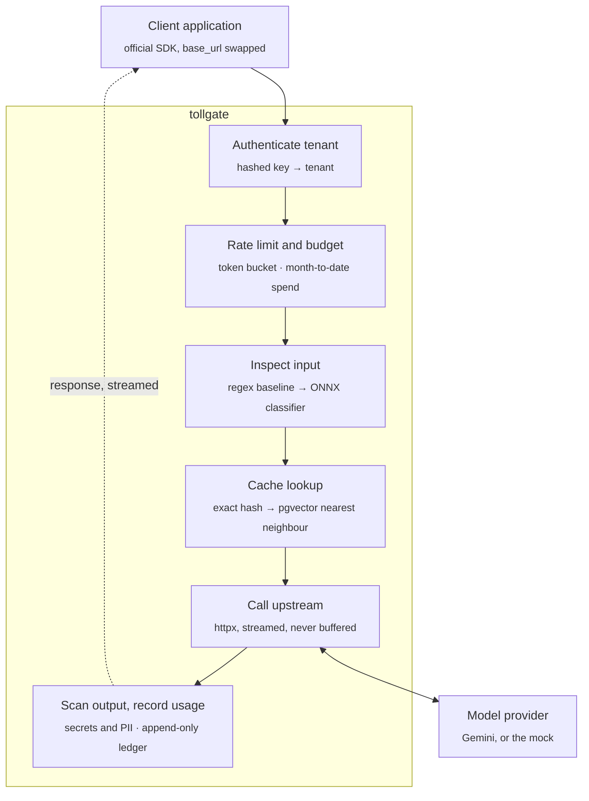
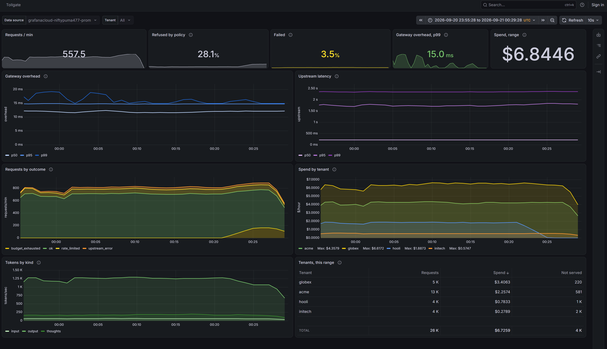

# Tollgate

A multi-tenant gateway for model API traffic. It sits between an application and a model provider
(Google Gemini), authenticates tenants, enforces rate limits and spend budgets, caches what it can,
inspects traffic in both directions, and records every token.

Request and response bodies stay byte-compatible with the provider's API, so an existing
application adopts Tollgate by changing one base URL, and the official SDK keeps working.

> **Status:** live at `https://tollgate.danmccabe.dev`, deployed from `main` by GitHub Actions.
> Streaming and non-streaming passthrough, tenant authentication, usage accounting, rate
> limits, spend budgets and observability work. Caching and detection are next.
> See [Roadmap](#roadmap).

## Why a gateway exists

An application that calls a model API directly has no good answer to a handful of questions: which
customer spent what, what happens when one of them gets stuck in a retry loop, whether a user
smuggled instructions into a prompt, and whether a response leaked a credential. Once more than one
team, customer or feature calls the API, each call site ends up reimplementing the same rules:
keeping the provider key out of client code, deciding who may spend how much, retrying rate limits,
logging usage for billing, and checking what crosses the boundary. Spread across services, those
rules drift apart. A gateway puts them in one place on the request path. It's also the only
component that sees every token in both directions, which makes it the right place to measure cost,
latency and cache effectiveness.

## How a request flows



The return path is the hard part. Output scanning wants a complete response, and streaming never
provides one.

## Design decisions

Decisions made up front, before the code that depends on them:

| Decision | Why |
|---|---|
| Byte-compatible with the provider API | Adoption is a base URL change. It also means streaming has to be relayed event by event, not rebuilt. |
| Provider credential stays server side | Tenants authenticate to Tollgate with their own keys and never see the upstream key. |
| Tenant keys stored only as SHA-256 hashes | A database leak doesn't expose live credentials. A short plaintext prefix identifies a key in logs. |
| Money in integer micro-cents | Floating-point cost errors are small, silent and impossible to reconstruct later, and a cent is too coarse to hold a request: one flash call costs a few hundred micro-cents. A test fails the build on any float or decimal column. |
| Budgets reserved before the upstream call | A streamed response's cost is unknown when it starts, so an estimate is reserved from the requested maximum and reconciled when the stream ends. |
| A reservation is a lease, not a lock | A gateway killed mid-stream would otherwise hold part of a tenant's budget until someone noticed. Reservations carry an expiry and the next request drops the ones that ran out. |
| Nothing in Redis is a source of truth | Every key is a cache of the ledger or in-flight bookkeeping, each with a TTL. That is what makes it safe to run Redis with eviction enabled. |
| Rate limits fail open, budgets do not | A limiter protects the upstream, so its outage must not become a total outage. A budget is money, and Postgres already holds the ledger, so losing Redis costs precision rather than enforcement. |
| Out of budget is 402, not 429 | Retrying will not work until the month turns over. A `Retry-After` measured in weeks is worse than no hint at all. |
| Caches scoped per tenant | A shared cache leaks information about one tenant's traffic to another. |
| Semantic cache threshold chosen from a measured curve | A wrong semantic hit is a correctness bug, not a performance trade-off. The false hit rate gets published next to the savings. |
| Detection defaults to monitor mode | Blocking is opt-in per tenant, which is how detection is rolled out in practice. |
| No prompt or response text in telemetry | Enforced by a test, not by convention: the check searches every span, metric label and log line for a canary. |
| Instrumentation written out rather than installed | The FastAPI auto-instrumentation records the query string, and a tenant may put its key in `?key=`. That would write a live credential into every trace, and traces leave the building. |
| The alert watches overhead, not total latency | Total latency is mostly the provider generating tokens. An alert on that fires whenever the model has a slow afternoon, and is muted within a week. |
| Metrics emitted in one place, at the end | A refusal never reaches the proxy, so metrics emitted there would omit every 401, 429 and 402 - exactly the requests a rejection rate is meant to count. |
| `/metrics` off in production | It lists tenant names and their spend, and the load balancer is public. Production pushes over OTLP, which needs no inbound route. |
| Every benchmark runs against a local mock | Tests and load tests cost nothing and don't depend on provider variability. |

### The provider credential never leaves the gateway

Tenants authenticate with Tollgate keys, sent in the same `x-goog-api-key` header the Gemini SDK
already uses. The gateway removes that key and attaches the provider key, which exists only in the
gateway's environment. Only an allowlist of request headers is forwarded upstream, a `?key=` query
parameter is stripped, and the key is held as a `SecretStr` so it can't appear in a log line or a
traceback. Tenants never hold a credential that works against the provider directly, so a leaked
tenant key can be revoked in one place without rotating the provider key for everyone.

### Telling a gateway failure from an upstream failure

Upstream errors pass through untouched, in Google's shape. Errors raised by the gateway itself
carry `"source": "gateway"`:

```json
{"error": {"code": 429, "message": "...", "status": "RESOURCE_EXHAUSTED"}}
{"error": {"source": "gateway", "code": "upstream_timeout", "message": "..."}}
```

Rate limits (429), server errors (5xx) and failed connections are retried with jittered
exponential backoff. Read timeouts are not: by then the upstream may already be generating, and
billing for, the response.

## How it runs and ships

Everything on the AWS side is Terraform. Nothing is clicked into existence, and the whole stack can
be destroyed and rebuilt from nothing in about five minutes.

```
GitHub push to main
   │  OIDC: a short-lived token, no AWS keys stored anywhere
   ▼
checks (lint, types, tests on Postgres, pip-audit, image build)
   │
   ├─► build image, tag = commit SHA, push to ECR, deploy by digest
   ├─► migrations: one-off Fargate task from the new image, `alembic upgrade head`
   ├─► update service, wait for it to stabilise
   └─► smoke test the live URL ──✗──► roll back to the previous task definition, fail red
                                       (ECS also rolls back by itself if tasks never get healthy)
```

```
        tollgate.danmccabe.dev                     Secrets Manager ─ DATABASE_URL, GEMINI_API_KEY
                  │ Route 53 alias                        │ read at startup by the execution role
                  ▼                                       ▼
   Application Load Balancer ── HTTPS, ACM cert ──► Fargate task (0.25 vCPU, 512 MB)
      health check: GET /readyz                       read-only filesystem, non-root
                                                      JSON logs → CloudWatch
                                                         │
                                          Neon Postgres ─┴─ Gemini API
```

Two stacks, because they have different lifetimes:

| Stack | Holds | Lifetime |
|---|---|---|
| `infra/bootstrap` | Terraform state bucket, Route 53 zone, ECR repository, secrets, the GitHub deploy role, the budget alarm | Applied rarely, never destroyed |
| `infra/main` | VPC, load balancer, certificate, ECS cluster, service and task definition, IAM roles, log group | Destroyed and rebuilt freely |

That split is what makes destroying cheap: images, secrets, DNS and every usage row survive it, so
a rebuild needs no manual steps and no data is at risk.

Costs stay low by design: no NAT gateway (tasks run in public subnets, reachable only from the load
balancer's security group), one small task, and logs expiring after 14 days.

## Results

Every number below will be regenerated by a command in this repository. Cells stay empty until the
measurement exists, including the ones that turn out badly.

| Measurement | Compared against | Phase | Result |
|---|---|---|---|
| Gateway overhead, p50 and p99 | Same call made directly to the provider | 1, 8 | +10.4 ms / +14.1 ms (local baseline, see below) |
| Added time to first token, streamed | Direct streaming call | 3 | **+5.2 ms** p50, **+5.4 ms** p99 (local) |
| Rate limit accuracy across containers | In-process counters vs Redis | 4 | in-process **+95%** at 2 tasks, **+388%** at 5; Redis **0%** at any count |
| Budget reservation error, streamed | Reserved estimate vs reconciled actual | 4 | estimate overshoots **14x** (median); reconciled error **0 micro-cents** |
| Usage rollup query time | Before and after the index, with plans | 4 | **7.7 ms → 0.2 ms**, 8,334 → 33 buffers |
| Cache hit rate, exact and semantic | Each other, and no cache | 6 | — |
| Spend avoided per 1,000 requests | Identical traffic with caching disabled | 6 | — |
| Semantic false hit rate at chosen threshold | Full threshold sweep | 6 | — |
| Injection recall and precision | Regex baseline on identical data | 7 | — |
| False positives on benign security-related prompts | Ordinary benign prompts | 7 | — |
| Added latency per detection layer | Detection disabled | 7 | — |
| Throughput ceiling and failure mode | Steady vs burst vs degraded upstream | 8 | — |
| Deploy time, merge to live | Pipeline runs | 2 | **~5 min** (checks, build, migrate, roll out, smoke test) |
| Monthly infrastructure cost | Billing console | 2 | **$1.22/day**, about **$37/month** running continuously |

The phase 1 baseline was measured on one Windows laptop: gateway and mock upstream on localhost,
Postgres in Docker, 300 sequential requests alternating direct and through the gateway, with the
mock holding a steady 100 ms response time. The overhead covers the key lookup, one usage row insert
and the extra hop, before any feature that does real work. Regenerate it with
`bench/baseline_latency.py`. The deployed figure in phase 8 will replace it.

Time to first token was measured the same way, with `bench/stream_ttft.py`: 60 streamed
requests each way, alternating. The first token arrives about 30% of the way through the
response, which is the check that matters. A gateway that buffered would show the first
token arriving at the end, and its added time to first token would equal the whole
response time rather than 5 ms.

The phase 4 numbers come from three commands, and their full output is committed under
`bench/results/`.

`bench/limit_accuracy.py` gives one tenant 600 requests a minute with a burst of 10, offers
twelve times that for three seconds, and counts what gets through. One container allows the
40 it should. Two allow 78, three allow 117, five allow 195 — each container refilling a
bucket of its own, and nothing in the code looking broken. With the buckets in Redis the
answer is 39 whatever the container count, because there is one bucket. (39 rather than 40:
the window closes a fraction before the last token refills.)

`bench/reservation_error.py` streams 21 requests with `maxOutputTokens` cycling from 64 to
4096 and compares each reservation with what the request actually cost. The estimate
overshoots by 14x at the median and 110x at worst — a request that asked for 4096 tokens and
got a short answer — which is budget a tenant cannot spend while the request is in flight.
After settlement the month's counter in Redis and the sum over the ledger agree exactly: an
error of zero micro-cents, not "within a cent".

`bench/rollup_plan.py` builds a throwaway database of 400,000 ledger rows across 25 tenants
and four months, then runs the budget check and the spend rollup under three index variants.
A sequential scan takes 7.7 ms and touches 8,334 buffers; `(tenant_id, created_at)` takes
1.1 ms and 2,508; adding `INCLUDE` for the columns both queries read takes 0.2 ms and 33,
because it becomes an index-only scan. The last figure is a best case — an index-only scan
still visits the heap for rows whose page is not yet marked all-visible, and on an
append-only table those are the newest rows, which is exactly what a current-month query
reads.

The cost is measured AWS spend for one full day with the stack up: the load balancer and
its IPv4 addresses are most of it, then Fargate, then pennies for everything else. The
stack is normally destroyed between work sessions (`terraform destroy` in `infra/main`,
about 5 minutes to rebuild), which brings AWS spend to roughly zero while keeping the
database, images, secrets and DNS. Neon is billed separately for the hours it is awake.

## Observability

One trace per request, one place that emits the metrics, and a rule about what may be
recorded that a test enforces.

### A trace

```
POST /v1beta/models/{model}:{method}     opened by the middleware, closed after the
  authenticate                           last event of a stream has been relayed
  rate_limit
  budget.reserve
  upstream                               the provider call, retries included
  ledger.write
  budget.settle
```

Subtract `upstream` from the root and what remains is the gateway's own overhead. That
separation is the point of the whole phase: it is the only number this service is
answerable for, and it is what the alert watches. An alert on total latency would fire
whenever the provider had a slow afternoon, and would be muted within a week.

The spans are written out by hand rather than installed. `opentelemetry-instrumentation-fastapi`
would produce a server span for free, and would record `url.full` and `http.target` with it -
both of which carry the query string, which is where the Gemini SDK is happy to put an API
key. Traces go to a third party, so that is a credential leaving the building on every
request. The spans here record `url.path` and never `url.full`.

### Metrics

Emitted from the middleware, once, at the end of every request. A refusal never reaches the
proxy, so metrics emitted from the proxy would silently omit every 401, 429 and 402 - which
are precisely the requests a rejection rate exists to count.

Histogram boundaries are chosen per instrument rather than inherited. The default buckets
step 0, 5, 10, 25, 50 ms, which is reasonable for a web request and useless here: measured
overhead is 10.4 ms at the median and 14.1 ms at the 99th, so every interesting value falls
in one bucket and a p99 reads "somewhere between 10 and 25". Overhead gets millisecond
boundaries; the upstream call, which runs from 100 ms to a minute, gets boundaries spread
over seconds. A percentile is only ever as precise as the bucket it lands in.

`GET /metrics` exists for local development and is off by default. It lists tenant names and
their spend, and the load balancer is public; production pushes over OTLP instead, which
needs no inbound route at all. Push also suits Fargate, where a task has no stable address
and would lose whatever it recorded between the last scrape and its shutdown.

### What telemetry may not carry

No prompt text, no response text, no headers, no query strings. Tenant, model, token counts,
cost and outcome, and nothing else. `tests/test_telemetry.py` sends a canary string through
the gateway - with the key in the query string, with a response full of fake secrets, and
once as a stream - then searches every span, every metric label and every log line for it.
The same test pins `httpx` to WARNING in `logging.json`, because httpx logs every request
URL at INFO and the gateway uses httpx to reach the provider.

### The dashboard and the alert

[](https://niftypuma477.grafana.net/dashboard/snapshot/J3Nw1LoCgwYKvDHCdcJKSbmQ3xNx3sHh)

**[Open the live snapshot](https://niftypuma477.grafana.net/dashboard/snapshot/J3Nw1LoCgwYKvDHCdcJKSbmQ3xNx3sHh)** - thirty minutes of traffic through the mock,
four tenants behaving differently on purpose. `initech` is held to a rate limit it keeps
hitting; `hooli` runs out of budget two thirds of the way across, and the amber band that
appears at that point is the reservation design from phase 4 doing its job. A snapshot
rather than a link to the live dashboard, because the AWS stack is destroyed between work
sessions and a live link would show an empty page; a snapshot embeds the data and keeps
working. Regenerate the traffic with `bench/demo_traffic.py`.

Two of the tiles are worth explaining, because the first version of this dashboard got
them wrong. **Refused by policy** and **Failed** were originally one number called "not
served", which turned red as soon as a tenant hit its budget - reporting the gateway
working exactly as designed as though something had broken. They are now separate, and
the refusal tile has no alarm colour at all: a tenant held to the limit it was given is
not a fault. The failure tile is scaled far tighter, because one request in twenty
failing is a bad afternoon where one in five refused may be a Tuesday.

[`dashboards/tollgate.json`](dashboards/tollgate.json) is the source of truth; Terraform
applies it from that file, so a pull request shows the real diff and an edit made in
Grafana's UI is drift that the next apply reverses. `infra/grafana` is a third stack because
its lifetime differs from both others: `infra/main` is destroyed between work sessions, and
taking the dashboard and alert down with it would break the published snapshot every time.

A test keeps the two honest about each other. Every metric the dashboard queries must be one
the gateway emits, checked for the alert as well since it lives in Terraform and would
survive a rename the JSON caught; and the outcomes the code can produce must be exactly the
outcomes the dashboard gives a colour, checked in both directions.

```sh
cp infra/grafana/terraform.tfvars.example infra/grafana/terraform.tfvars   # fill it in
terraform -chdir=infra/grafana init && terraform -chdir=infra/grafana apply
```

Apply it after telemetry is flowing. Before then an empty panel could mean a wrong metric
name or simply nothing sent yet, and there is no way to tell which.

## Roadmap

- [x] **0. Scaffold.** uv, ruff and mypy; mock upstream with scripted SSE and faults; Postgres and
  pgvector via Compose; Alembic with `tenants` and `api_keys`.
- [x] **1. Passthrough proxy.** Tenant key auth with revocation, provider key held server side,
  one usage row per request, pooled httpx client with timeouts and jittered retries, distinct
  gateway and upstream error shapes.
- [x] **2. Ship it.** Terraform for ECR, ECS Fargate, ALB, IAM and Secrets Manager; GitHub Actions
  with OIDC that tests, deploys, smoke tests and rolls back; readiness checks; a billing alarm.
- [x] **3. Streaming.** Unbuffered SSE relay, usage parsed from the stream, correct accounting on
  client disconnect and mid-stream upstream failure, bounded memory.
- [x] **4. Limits and budgets.** Per-tenant token buckets in Redis with an atomic Lua script,
  versioned price table, money in integer micro-cents, budget reservation held as an expiring
  lease and reconciled on settlement, a covering index chosen from the query plan, and
  `GET /v1/spend` per tenant.
- [x] **5. Observability.** One OpenTelemetry trace per request with the upstream call as its
  own span, Prometheus metrics whose histogram boundaries were chosen for the numbers being
  measured, a Grafana dashboard and an overhead alert both applied from Terraform, and a test
  that fails the build if a prompt reaches a span, a metric label or a log line.
- [ ] **6. Caching.** Exact cache on a normalised request hash, semantic cache on pgvector, cached
  responses replayed as a stream, threshold picked from a precision–recall sweep.
- [ ] **7. Detection.** Regex baseline, ONNX classifier for prompt injection, secret and PII
  scanning on output, per-tenant policy modes, an evaluation harness wired into CI.
- [ ] **8. Load test and write-up.** k6 scenarios for steady load, bursts, a degraded upstream,
  and warm vs cold cache.

### Out of scope

- **A web console.** Grafana is the interface; tenants are created with a small CLI.
- **Multiple providers.** One provider behind a thin interface, so adding a second stays possible.
- **Training a classifier.** A published model is integrated and measured.
- **Signup, onboarding or billing.**
- **Kubernetes.** Fargate and Terraform cover the deployment story.
- **A frontend.**

## Stack

| Layer | Choice | Status |
|---|---|---|
| Language | Python 3.13 | in use |
| Web | FastAPI, uvicorn | in use |
| HTTP client | httpx | in use |
| Database | Postgres 17 with pgvector (Neon in production) | in use locally |
| Migrations | Alembic, SQLAlchemy 2.0 async | in use |
| Tooling | uv, ruff, mypy (strict), pytest | in use |
| Local environment | Docker Compose | in use |
| Counters | Redis (Upstash in production) | in use |
| Compute | AWS ECS Fargate | in use |
| Infrastructure | Terraform | in use |
| Pipeline | GitHub Actions with OIDC | in use |
| Tracing and metrics | OpenTelemetry, Prometheus, Grafana Cloud | in use |
| Detection | ONNX Runtime with a published classifier | phase 7 |
| Load testing | k6 | phase 8 |

## Getting started

Requires [uv](https://docs.astral.sh/uv/) and Docker.

```sh
cp .env.example .env
docker compose up -d --wait     # Postgres + pgvector on :5432, mock upstream on :8001
uv sync
uv run alembic upgrade head
```

Create a tenant and a key, then start the gateway on :8000:

```sh
uv run tollgate create-tenant acme
uv run tollgate create-key acme --name laptop    # prints the key once
uv run uvicorn tollgate.main:app --port 8000
```

Call it with Google's own SDK, unchanged except for the base URL:

```python
from google import genai

client = genai.Client(api_key="tg_...", http_options={"base_url": "http://localhost:8000"})
print(client.models.generate_content(model="gemini-3.7-flash", contents="Hello").text)
```

`bench/sdk_smoke.py` does exactly this (`uv run --with google-genai python bench/sdk_smoke.py tg_...`).
By default the gateway forwards to the mock. To use the real API, set
`UPSTREAM_BASE_URL=https://generativelanguage.googleapis.com` and `GEMINI_API_KEY` in `.env`.

Other key commands: `uv run tollgate list-keys acme` and `uv run tollgate revoke-key tg_AbCdEfGhI`.

Limits, budgets and prices are set the same way:

```sh
uv run tollgate tenants                                   # limits and budgets, per tenant
uv run tollgate set-limits acme --rpm 120 --burst 240     # or --unlimited
uv run tollgate set-budget acme --usd 25                  # or --unlimited
uv run tollgate prices                                    # every price version in force
uv run tollgate set-price gemini-3.7-flash --input 0.30 --output 2.50
```

A tenant reads its own spend with its own key, and can see no one else's:

```sh
curl -H "x-goog-api-key: tg_..." localhost:8000/v1/spend          # this month
curl -H "x-goog-api-key: tg_..." localhost:8000/v1/spend?month=2026-08
```

Rate limiting uses in-process buckets by default, which is correct for one container and
wrong for several. Set `LIMITER_BACKEND=redis` and `REDIS_URL` to share them; see
[`src/tollgate/limits.py`](src/tollgate/limits.py) for why the two backends both exist.

Telemetry is off by default. `METRICS_ENDPOINT_ENABLED=True` serves `GET /metrics` locally;
`OTEL_ENABLED=True` with an endpoint and headers ships traces and metrics onward:

```sh
OTEL_ENABLED=True OTEL_CONSOLE=True uv run uvicorn tollgate.main:app --port 8000
curl localhost:8000/metrics
```

Run the checks CI runs:

```sh
uv run ruff check . && uv run ruff format --check .
uv run mypy
uv run pytest
```

The test suite needs Postgres from `docker compose` but no network access and no provider key. It
creates and migrates its own `tollgate_test` database, so the development database is untouched.

## Mock upstream

[`mock_upstream/main.py`](mock_upstream/main.py) imitates the Gemini `v1beta` API so everything
can be developed, tested and load tested without spending money. It supports `generateContent`,
`streamGenerateContent` (SSE with `?alt=sse`, a JSON array otherwise), `countTokens` and
embeddings, with Google-shaped errors and `usageMetadata` on every response.

It can be told to misbehave in two ways.

**Per request**, with directives in the prompt text, which pass through the gateway untouched:

| Directive | Effect |
|---|---|
| `[[mock:error=429]]` | Return that HTTP status with a Google-style error body |
| `[[mock:slow=2000]]` | Add latency in milliseconds |
| `[[mock:hang]]` | Wait five minutes before responding (timeout testing) |
| `[[mock:midstream]]` | Drop the connection halfway through a stream |
| `[[mock:tokens=500]]` | Produce roughly that many output tokens |
| `[[mock:thinking=200]]` | Report thinking tokens, which are billed as output |
| `[[mock:leak]]` | Reply with fake PII, a fake credential and an injection string |

**As a script**, which the next generate call plays exactly:

```sh
curl -X POST localhost:8001/_mock/scripts -H 'content-type: application/json' \
  -d '{"steps": [{"text": "Hel"}, {"delayMs": 500, "text": "lo"}, {"disconnect": true}]}'
```

`GET /_mock/stats` shows how many calls reached the upstream and how many tokens were served, which
is how cache hits are verified. `GET /_mock/requests` shows the request bodies exactly as the
upstream received them, which is how input redaction is verified. The module docstring is the full
reference.

## Migrations

```sh
uv run alembic revision --autogenerate -m "describe the change"
uv run alembic upgrade head
uv run alembic check            # fails if models and migrations have drifted
```

Autogenerate compares the SQLAlchemy models with the live database. It doesn't detect extensions,
custom types, functions or triggers, and it reports a rename as a drop followed by an add. Read
every generated migration before applying it.

## Repository layout

```
src/tollgate/
├── main.py            ASGI app and routes
├── config.py          settings from the environment
├── auth.py            key hashing, tenant resolution
├── limits.py          token bucket, budget reservation
├── usage.py           append-only ledger, cost model
├── telemetry.py       OpenTelemetry and Prometheus wiring
├── proxy/             passthrough.py (unary), streaming.py (SSE relay)
├── cache/             exact.py (request hash), semantic.py (embeddings + pgvector)
├── detect/            baseline.py (regex), classifier.py (ONNX), scanner.py (secrets, PII)
└── db/models.py       SQLAlchemy models
migrations/            Alembic environment and versions
mock_upstream/         fake Gemini API: SSE, usage, scripted faults
tests/                 unit and integration tests, no network
bench/                 baseline and streaming latency, limit accuracy, reservation error,
                       rollup query plans; results committed under bench/results/
infra/                 Terraform: bootstrap (durable), main (rebuildable), grafana
dashboards/            Grafana dashboard JSON, applied by infra/grafana, and its screenshot
postgres/              init SQL for the local database
```
