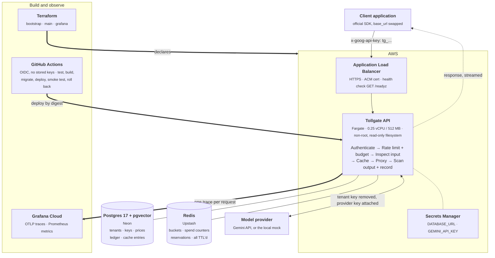
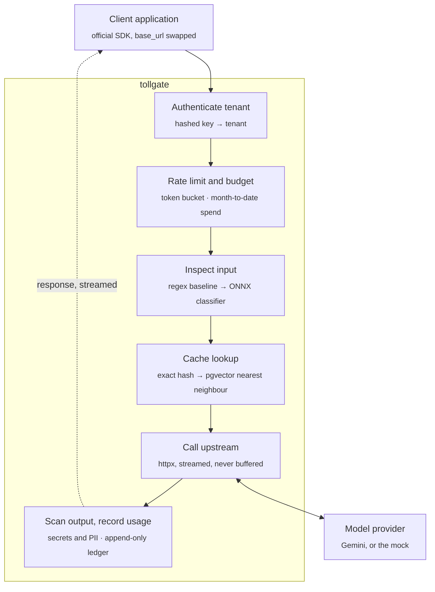

# Tollgate

A multi-tenant gateway for model API traffic. It sits between an application and a model provider
(Google Gemini), authenticates tenants, enforces rate limits and spend budgets, caches what it can,
inspects traffic in both directions, and records every token.

Request and response bodies stay byte-compatible with the provider's API, so an existing
application adopts Tollgate by changing one base URL, and the official SDK keeps working.

> Live at `https://tollgate.danmccabe.dev`, deployed from `main` by GitHub Actions. The root of
> that host serves a page explaining what it is; everything else there wants a tenant key.

## Why a gateway exists

An application that calls a model API directly has no good answer to a handful of questions: which
customer spent what, what happens when one of them gets stuck in a retry loop, whether a user
smuggled instructions into a prompt, and whether a response leaked a credential. Once more than one
team, customer or feature calls the API, each call site reimplements the same rules, and spread
across services those rules drift apart. A gateway puts them in one place on the request path, and
it is the only component that sees every token in both directions.

## Architecture



Who trusts what, and what happens when each piece is compromised, is in
**[docs/threat-model.md](docs/threat-model.md)**.

## How a request flows



Every stage can end the request: 401 for an unknown or revoked key, 429 over the rate limit, 402
over budget, 403 for a prompt or a response that policy refused. The return path is the hard part —
output scanning wants a complete response, and streaming never provides one.

## What it does

- **Passthrough, streamed and not.** Server-sent events are relayed event by event and never
  buffered, with usage parsed out of the stream so accounting survives a client hanging up
  mid-response or an upstream failing after a 200 has already gone out.
- **Tenant auth.** Keys stored only as SHA-256 hashes, revocable, several live per tenant. The
  provider credential stays in the gateway's environment and is never visible to a tenant.
- **Rate limits and spend budgets.** Per-tenant token buckets in Redis, a versioned price table,
  money in integer micro-cents, and a budget reserved before the upstream call then reconciled when
  the stream ends. Rate limits fail open; budgets do not.
- **Two-tier cache.** A versioned hash over the normalised request, scoped per tenant, plus an
  optional pgvector similarity tier. Cached responses are replayed as real event streams.
- **Detection both ways.** A regex baseline and a pinned ONNX classifier on the way in; credential
  and PII scanning on the way back, with a hold-back window that contains a leak on a stream rather
  than noticing one. Off, monitor or block per tenant; monitor by default.
- **Observability.** One OpenTelemetry trace per request with the upstream call as its own span, so
  the gateway's own overhead can be separated from the provider's latency. No prompt or response
  text reaches a span, a metric label or a log line, and a test enforces it.

Every one of those has a reason it works the way it does; they are written up in
**[docs/design.md](docs/design.md)**.

## Results

Headline figures. The full table, the method behind each one and the runs that came out badly are
in **[docs/results.md](docs/results.md)**; raw output is committed under `bench/results/`.

| Measurement | Result |
|---|---|
| Gateway overhead | **+10.4 ms** p50 sequential; **12.0 ms** mean and flat to 60 requests a second |
| Added time to first token, streamed | **+5.2 ms** p50 |
| Rate limit accuracy across containers | in-process drifts to **+388%** at 5 tasks; Redis **0%** at any count |
| Cache hit rate and spend avoided | **61.5–89.2%** exact, saving **59–96%** of upstream spend |
| Semantic cache threshold | **no safe threshold exists** for `gemini-embedding-001`, so the tier ships off |
| Injection detection | **0.666** recall at **0.938** precision, against **0.374** at **0.908** for the regex baseline |
| Throughput ceiling | overhead flat to **60 rps**, then the whole single-laptop stack saturates together |
| Deploy time, merge to live | **~5 min**, with automatic rollback on a failed smoke test |
| Infrastructure cost | **~$37/month** running continuously |

Every number is produced by a script in `bench/`, and `bench/run_all.py` runs all of them. It
refuses to produce a row it cannot measure honestly — a gateway without the semantic tier or the
classifier enabled gets a named skip rather than a number measured with the feature switched off.


**[Open the live snapshot](https://niftypuma477.grafana.net/dashboard/snapshot/3v3pBGAjI8laSizaSMOFGKjUl99pxMvf?from=2026-09-22T02:31:22.474Z&to=2026-09-22T02:51:22.474Z&timezone=utc&var-datasource=grafanacloud-prom&var-tenant=$__all)** — thirty minutes of traffic
from five tenants behaving differently on purpose. Two more screens
([cache](dashboards/tollgate-2.png), [detection](dashboards/tollgate-3.png)) and how the dashboard
is built are in [docs/operations.md](docs/operations.md).

## Getting started

Requires [uv](https://docs.astral.sh/uv/) and Docker.

```sh
cp .env.example .env
docker compose up -d --wait     # Postgres + pgvector on :5432, mock upstream on :8001
uv sync
uv run alembic upgrade head
```

Create a tenant and a key, then start the gateway on :8000:

```sh
uv run tollgate create-tenant acme
uv run tollgate create-key acme --name laptop    # prints the key once
uv run uvicorn tollgate.main:app --port 8000
```

Call it with Google's own SDK, unchanged except for the base URL:

```python
from google import genai

client = genai.Client(api_key="tg_...", http_options={"base_url": "http://localhost:8000"})
print(client.models.generate_content(model="gemini-3.7-flash", contents="Hello").text)
```

By default the gateway forwards to the mock upstream, so everything below runs without a provider
key and without spending anything. To use the real API, set
`UPSTREAM_BASE_URL=https://generativelanguage.googleapis.com` and `GEMINI_API_KEY` in `.env`.

Limits, budgets, prices and detection mode are set from the same CLI:

```sh
uv run tollgate tenants                                   # limits and budgets, per tenant
uv run tollgate set-limits acme --rpm 120 --burst 240     # or --unlimited
uv run tollgate set-budget acme --usd 25                  # or --unlimited
uv run tollgate set-detection acme --mode block           # off | monitor | block
uv run tollgate set-price gemini-3.7-flash --input 0.30 --output 2.50
```

Run the checks CI runs:

```sh
uv run ruff check . && uv run ruff format --check .
uv run mypy
uv run pytest
```

The test suite needs Postgres from `docker compose` but no network access and no provider key. It
creates and migrates its own `tollgate_test` database, so the development database is untouched.

Deployment, the mock upstream, migrations and the telemetry setup are in
**[docs/operations.md](docs/operations.md)**.

## Stack

| Layer | Choice |
|---|---|
| Language | Python 3.13 |
| Web | FastAPI, uvicorn |
| HTTP client | httpx |
| Database | Postgres 17 with pgvector (Neon in production) |
| Migrations | Alembic, SQLAlchemy 2.0 async |
| Tooling | uv, ruff, mypy (strict), pytest |
| Local environment | Docker Compose |
| Counters | Redis (Upstash in production) |
| Compute | AWS ECS Fargate |
| Infrastructure | Terraform |
| Pipeline | GitHub Actions with OIDC |
| Tracing and metrics | OpenTelemetry, Prometheus, Grafana Cloud |
| Embeddings and vector search | pgvector 0.8, HNSW, `gemini-embedding-001` (tier off by default) |
| Detection | ONNX Runtime, `tokenizers`, a pinned published classifier |
| Load testing | k6, run from its container |

## Repository layout

```
src/tollgate/
├── main.py            ASGI app and routes
├── config.py          settings from the environment
├── auth.py            key hashing, tenant resolution
├── limits.py          token bucket, budget reservation
├── usage.py           append-only ledger, cost model
├── telemetry.py       OpenTelemetry and Prometheus wiring
├── proxy/             passthrough.py (unary), streaming.py (SSE relay)
├── cache/             normalisation, lookup and store, stream replay, vector search
├── detect/            regex baseline, ONNX classifier, output scanner, policy
├── db/models.py       SQLAlchemy models
└── static/index.html  the page served at the root of the deployed host
migrations/            Alembic environment and versions
mock_upstream/         fake Gemini API: SSE, usage, scripted faults
tests/                 unit and integration tests, no network
bench/                 every measurement in Results, run_all.py runs the lot,
                       load/ holds the k6 scenarios, results under bench/results/
models/                classifier graphs, fetched and verified, never committed
infra/                 Terraform: bootstrap (durable), main (rebuildable), grafana
dashboards/            Grafana dashboard JSON, applied by infra/grafana, and its screenshots
docs/                  design notes, full results, operations
postgres/              init SQL for the local database
```

## Out of scope

- **A web console.** Grafana is the interface; tenants are created with a small CLI.
- **Multiple providers.** One provider behind a thin interface, so adding a second stays possible.
- **Training a classifier.** A published model is integrated and measured.
- **Signup, onboarding or billing.**
- **Kubernetes.** Fargate and Terraform cover the deployment story.
- **A frontend.** One static page at the root says what the host is; nothing on it is
  generated, authenticated or wired to any of the gateway's state.
