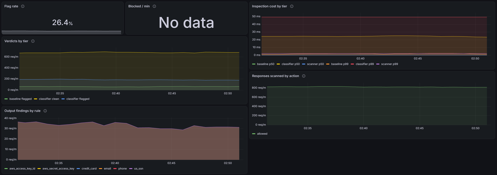

# Running and operating it

Deployment, observability, the mock upstream and migrations. Getting started locally is in
the [README](../README.md).

## How it runs and ships

Everything on the AWS side is Terraform. Nothing is clicked into existence, and the whole stack can
be destroyed and rebuilt from nothing in about five minutes.

```
GitHub push to main
   │  OIDC: a short-lived token, no AWS keys stored anywhere
   ▼
checks (lint, types, tests on Postgres, pip-audit, image build)
   │
   ├─► build image, tag = commit SHA, push to ECR, deploy by digest
   ├─► migrations: one-off Fargate task from the new image, `alembic upgrade head`
   ├─► update service, wait for it to stabilise
   └─► smoke test the live URL ──✗──► roll back to the previous task definition, fail red
                                       (ECS also rolls back by itself if tasks never get healthy)
```

```
        tollgate.danmccabe.dev                     Secrets Manager ─ DATABASE_URL, GEMINI_API_KEY
                  │ Route 53 alias                        │ read at startup by the execution role
                  ▼                                       ▼
   Application Load Balancer ── HTTPS, ACM cert ──► Fargate task (0.25 vCPU, 512 MB)
      health check: GET /readyz                       read-only filesystem, non-root
                                                      JSON logs → CloudWatch
                                                         │
                                          Neon Postgres ─┴─ Gemini API
```

Two stacks, because they have different lifetimes:

| Stack | Holds | Lifetime |
|---|---|---|
| `infra/bootstrap` | Terraform state bucket, Route 53 zone, ECR repository, secrets, the GitHub deploy role, the budget alarm | Applied rarely, never destroyed |
| `infra/main` | VPC, load balancer, certificate, ECS cluster, service and task definition, IAM roles, log group | Destroyed and rebuilt freely |

That split is what makes destroying cheap: images, secrets, DNS and every usage row survive it, so
a rebuild needs no manual steps and no data is at risk.

Costs stay low by design: no NAT gateway (tasks run in public subnets, reachable only from the load
balancer's security group), one small task, and logs expiring after 14 days.

## Observability

One trace per request, one place that emits the metrics, and a rule about what may be
recorded that a test enforces.

### A trace

```
POST /v1beta/models/{model}:{method}     opened by the middleware, closed after the
  authenticate                           last event of a stream has been relayed
  rate_limit
  budget.reserve
  upstream                               the provider call, retries included
  ledger.write
  budget.settle
```

Subtract `upstream` from the root and what remains is the gateway's own overhead. That
separation is the point of the trace: it is the only number this service is answerable
for, and it is what the alert watches. An alert on total latency would fire whenever the
provider had a slow afternoon, and would be muted within a week.

The spans are written out by hand rather than installed. `opentelemetry-instrumentation-fastapi`
would produce a server span for free, and would record `url.full` and `http.target` with it -
both of which carry the query string, which is where the Gemini SDK is happy to put an API
key. Traces go to a third party, so that is a credential leaving the building on every
request. The spans here record `url.path` and never `url.full`.

### Metrics

Emitted from the middleware, once, at the end of every request. A refusal never reaches the
proxy, so metrics emitted from the proxy would silently omit every 401, 429 and 402 - which
are precisely the requests a rejection rate exists to count.

Histogram boundaries are chosen per instrument rather than inherited. The default buckets
step 0, 5, 10, 25, 50 ms, which is reasonable for a web request and useless here: measured
overhead is 10.4 ms at the median and 14.1 ms at the 99th, so every interesting value falls
in one bucket and a p99 reads "somewhere between 10 and 25". Overhead gets millisecond
boundaries; the upstream call, which runs from 100 ms to a minute, gets boundaries spread
over seconds. A percentile is only ever as precise as the bucket it lands in.

`GET /metrics` exists for local development and is off by default. It lists tenant names and
their spend, and the load balancer is public; production pushes over OTLP instead, which
needs no inbound route at all. Push also suits Fargate, where a task has no stable address
and would lose whatever it recorded between the last scrape and its shutdown.

### What telemetry may not carry

No prompt text, no response text, no headers, no query strings. Tenant, model, token counts,
cost and outcome, and nothing else. `tests/test_telemetry.py` sends a canary string through
the gateway - with the key in the query string, with a response full of fake secrets, and
once as a stream - then searches every span, every metric label and every log line for it.
The same test pins `httpx` to WARNING in `logging.json`, because httpx logs every request
URL at INFO and the gateway uses httpx to reach the provider.

### The dashboard and the alert

[](https://niftypuma477.grafana.net/dashboard/snapshot/3v3pBGAjI8laSizaSMOFGKjUl99pxMvf?from=2026-09-22T02:31:22.474Z&to=2026-09-22T02:51:22.474Z&timezone=utc&var-datasource=grafanacloud-prom&var-tenant=$__all)

[](https://niftypuma477.grafana.net/dashboard/snapshot/3v3pBGAjI8laSizaSMOFGKjUl99pxMvf?from=2026-09-22T02:31:22.474Z&to=2026-09-22T02:51:22.474Z&timezone=utc&var-datasource=grafanacloud-prom&var-tenant=$__all)

[](https://niftypuma477.grafana.net/dashboard/snapshot/3v3pBGAjI8laSizaSMOFGKjUl99pxMvf?from=2026-09-22T02:31:22.474Z&to=2026-09-22T02:51:22.474Z&timezone=utc&var-datasource=grafanacloud-prom&var-tenant=$__all)

**[Open the live snapshot](https://niftypuma477.grafana.net/dashboard/snapshot/3v3pBGAjI8laSizaSMOFGKjUl99pxMvf?from=2026-09-22T02:31:22.474Z&to=2026-09-22T02:51:22.474Z&timezone=utc&var-datasource=grafanacloud-prom&var-tenant=$__all)** - thirty minutes of traffic through the mock, from five
tenants behaving differently on purpose. `initech` is held to a rate limit it keeps hitting;
`hooli` runs out of budget two thirds of the way across, and the amber band that appears at
that point is the budget reservation doing its job. The second screen is the cache: outcomes
by tier, and what the two tiers saved against what the semantic one spent looking. The third
is detection - verdicts by tier, what inspection cost, and what the output scanner found -
and `umbrella` is the tenant in `block` mode, so the refusals on it are detection enforcing
rather than reporting.

That snapshot was taken with the classifier enabled, which is *not* the shipped default, and
the overhead panel shows why: 50 ms at the median against the 10 ms this gateway adds without
it. It is the honest picture of what the feature costs when it is switched on. A snapshot rather than a link to the
live dashboard, because the AWS stack is destroyed between work sessions and a live link
would show an empty page; a snapshot embeds the data and keeps working. Regenerate the
traffic with `bench/demo_traffic.py`.

Retaking those pictures is two steps, because a screenshot is the one artefact that cannot
be regenerated from this repository and so has to be checked another way: capture them from
the live dashboard, then run `uv run python dashboards/manifest.py` to record the hash of
the dashboard they were taken from. A panel edited without a retake then fails the build.
The obvious check - is the PNG newer than the JSON - cannot work, because git does not store
modification times: on a fresh checkout every file is written within the same millisecond,
and which one wins is decided by whatever order the checkout happens to use.

The hit rate on that snapshot is not a result and is not quoted as one. `demo_traffic.py`
draws from a handful of prompts per tenant, so it repeats itself far more than real
traffic would; it exists to give the panels shape. The measured cache numbers are in the
Results table above, and they come from `bench/cache_savings.py`, which sweeps the repeat
rate on purpose rather than picking a flattering one.

**Refused by policy** and **Failed** are two tiles rather than one, because they mean
opposite things. A refusal is the gateway working: a tenant held to the limit it was
given, so that tile carries no alarm colour at any value. A failure is the gateway not
working, and its tile is scaled far tighter — one request in twenty failing is a bad
afternoon, where one in five refused may be a Tuesday. Counting them together would turn
a correctly enforced budget red.

[`dashboards/tollgate.json`](../dashboards/tollgate.json) is the source of truth; Terraform
applies it from that file, so a pull request shows the real diff and an edit made in
Grafana's UI is drift that the next apply reverses. `infra/grafana` is a third stack because
its lifetime differs from both others: `infra/main` is destroyed between work sessions, and
taking the dashboard and alert down with it would break the published snapshot every time.

A test keeps the two honest about each other. Every metric the dashboard queries must be one
the gateway emits, checked for the alert as well since it lives in Terraform and would
survive a rename the JSON caught; and the outcomes the code can produce must be exactly the
outcomes the dashboard gives a colour, checked in both directions.

```sh
cp infra/grafana/terraform.tfvars.example infra/grafana/terraform.tfvars   # fill it in
terraform -chdir=infra/grafana init && terraform -chdir=infra/grafana apply
```

Apply it after telemetry is flowing. Before then an empty panel could mean a wrong metric
name or simply nothing sent yet, and there is no way to tell which.

## Mock upstream

[`mock_upstream/main.py`](../mock_upstream/main.py) imitates the Gemini `v1beta` API so everything
can be developed, tested and load tested without spending money. It supports `generateContent`,
`streamGenerateContent` (SSE with `?alt=sse`, a JSON array otherwise), `countTokens` and
embeddings, with Google-shaped errors and `usageMetadata` on every response.

It can be told to misbehave in two ways.

**Per request**, with directives in the prompt text, which pass through the gateway untouched:

| Directive | Effect |
|---|---|
| `[[mock:error=429]]` | Return that HTTP status with a Google-style error body |
| `[[mock:slow=2000]]` | Add latency in milliseconds |
| `[[mock:hang]]` | Wait five minutes before responding (timeout testing) |
| `[[mock:midstream]]` | Drop the connection halfway through a stream |
| `[[mock:tokens=500]]` | Produce roughly that many output tokens |
| `[[mock:thinking=200]]` | Report thinking tokens, which are billed as output |
| `[[mock:leak]]` | Reply with fake PII, a fake credential and an injection string |

**As a script**, which the next generate call plays exactly:

```sh
curl -X POST localhost:8001/_mock/scripts -H 'content-type: application/json' \
  -d '{"steps": [{"text": "Hel"}, {"delayMs": 500, "text": "lo"}, {"disconnect": true}]}'
```

`GET /_mock/stats` shows how many calls reached the upstream and how many tokens were served, which
is how cache hits are verified. `GET /_mock/requests` shows the request bodies exactly as the
upstream received them, which is how input redaction is verified. The module docstring is the full
reference.

## Migrations

```sh
uv run alembic revision --autogenerate -m "describe the change"
uv run alembic upgrade head
uv run alembic check            # fails if models and migrations have drifted
```

Autogenerate compares the SQLAlchemy models with the live database. It doesn't detect extensions,
custom types, functions or triggers, and it reports a rename as a drop followed by an add. Read
every generated migration before applying it.

## Operating a running gateway

A tenant reads its own spend with its own key, and can see no one else's:

```sh
curl -H "x-goog-api-key: tg_..." localhost:8000/v1/spend          # this month
curl -H "x-goog-api-key: tg_..." localhost:8000/v1/spend?month=2026-08
```

Rate limiting uses in-process buckets by default, which is correct for one container and
wrong for several. Set `LIMITER_BACKEND=redis` and `REDIS_URL` to share them; see
[`src/tollgate/limits.py`](../src/tollgate/limits.py) for why the two backends both exist.

Telemetry is off by default. `METRICS_ENDPOINT_ENABLED=True` serves `GET /metrics` locally;
`OTEL_ENABLED=True` with an endpoint and headers ships traces and metrics onward:

```sh
OTEL_ENABLED=True OTEL_CONSOLE=True uv run uvicorn tollgate.main:app --port 8000
curl localhost:8000/metrics
```
